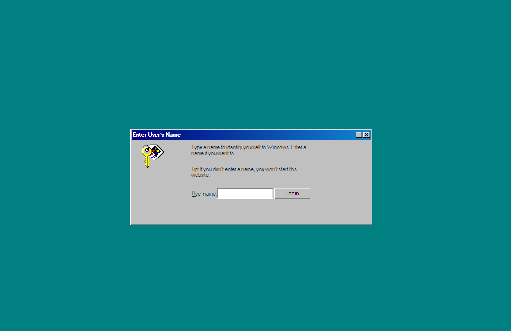

# windows98_todolist
> 윈도우 98 컨셉으로 구현해 본 TODO LIST 웹사이트입니다.

  
   
   

## 프로젝트 소개
  

프로젝트 개요 / 동기

 

## 환경 설정
index.html을 통해 실행 해주세요.
 

## 기술 스택

|  HTML5  |   CSS   |   JavaScript  | 
| :-----: | :-----: | :-----------: | 
| ![html5] | ![css]  | ![javascript] | 

 

## 구현 기능

### 기능 1

### 기능 2

### 기능 3

### 기능 4

 

## 사용 예제

 

## 라이센스

 

<!-- Stack Icon Refernces -->
[html5]: /assets/readme/html5.svg
[css]: /assets/readme/css.svg
[javascript]: /assets/readme/javascript.svg

<!--Readme 참고 사이트-->
<!--https://github.com/n0hack/readme-template/blob/main/README.md-->
<!--https://github.com/n0hack/readme-template-->
